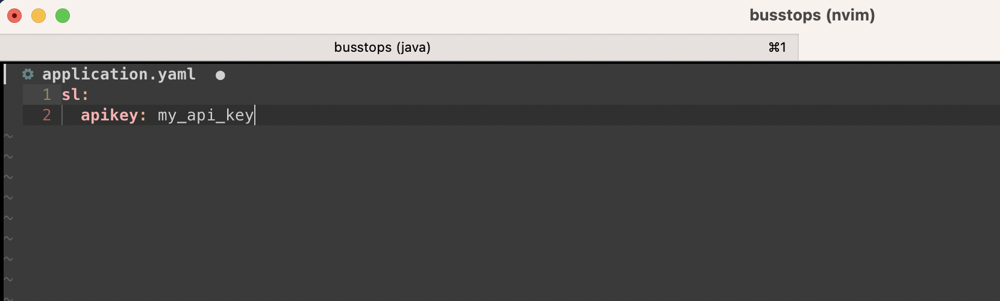
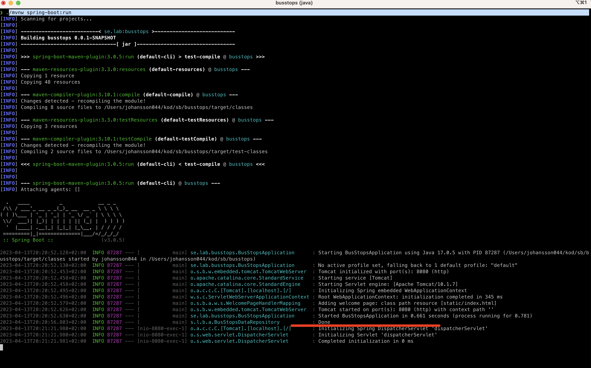

## Busstops application
This application provides an API and a Webpage to display Stockholm Lokaltrafik bus lines and their respective bus stops.
The 10 bus lines with the most stops are displayed.

The app consists of a Spring Boot backend and a Next.js frontend.
The Spring Boot backend is set up to deliver the Next.js frontend as a static page with client side data fetching.
At build time the Next.js app is built and copied into the `src/main/resources/static` folder of the Spring Boot app.

Spring Boot app home directory: `<Root of the project>`

Next.js app home directory: `<Root of the project>/src/main/webapp/busstops`

### Running the application
Prerequisites: Java 17 installed and a valid api key for the SL api:s.
Api keys can be acquired at https://www.trafiklab.se/

1. Add the SL api key to the `sl.apikey` property in `src/main/resources/application.yaml`:
    
2. In the root folder of the application, run

    `
    ./mvnw spring-boot:run
    `
2. Please allow the backend app some 10 - 15 seconds to fetch and parse SL data before loading the web page 😉.
   Look for "Done" being printed in the log, see below:
    
3. Load `http://localhost:8080/` in your browser

### Running the application in dev mode
For faster turnaround during development the Next.js app can be run standalone.

To do this, first use 
1. Make sure `yarn`  is installed locally
2. Replace `src/main/webapp/busstops/next.config.js` with `src/main/webapp/busstops/next.config_standalone.js`
2. Start the Spring Boot app as described above
3. In the Next.js home directory, run

   `
   yarn install && yarn dev
   `
4. Load `http://localhost:3000/` in your browser 

### Building 
To build the Next.js app, i e bundle it and make it available for the Spring Boot app to serve it statically, run the following in the Next.js home directory: 
`yarn build && cp -r out/* ../../../main/resources/static`

